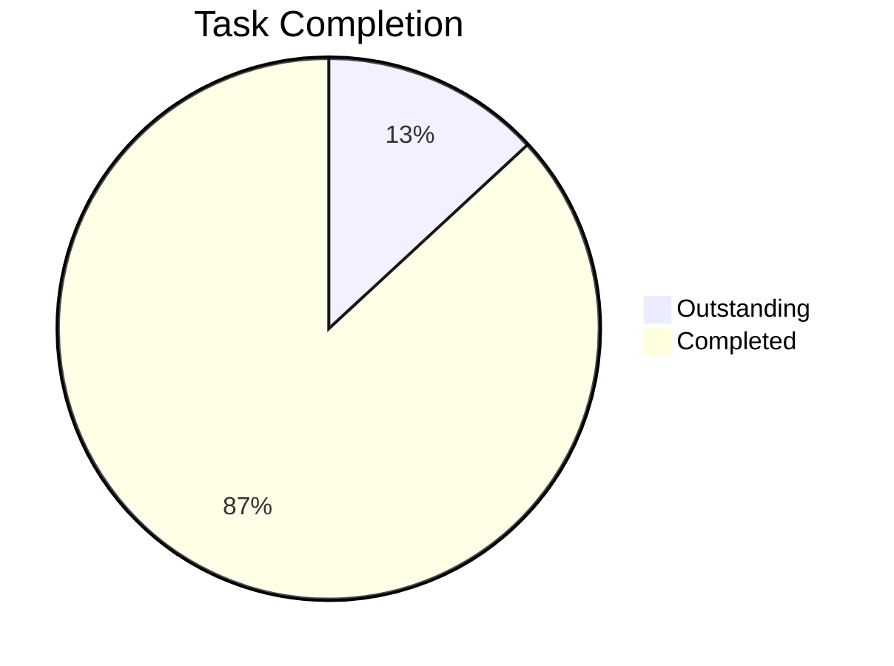

# EuroCRM Task Dashboard

## Completion overview

**Overall progress: 87%** (53 / 61 tasks)

| Section | Outstanding | Completed | Progress |
| ------- | ----------- | --------- | -------- |
| Next steps | 2 | 3 | 60% |
| Document sections | 5 | 26 | 84% |
| Wiki content | 0 | 25 | 100% |

## Completed tasks

### PDF Processing — Completed

- [x] Create [[wiki/problem-statement]] from PDF Section I #task
- [x] Create [[wiki/power-platform-dataverse/solution-package-model]] from PDF layered architecture #task
- [x] Create [[wiki/crm-lite-mvp-scope]] from PDF MVP scope #task
- [x] Create [[wiki/client-data-model]] from PDF Section II #task
- [x] Create [[wiki/property-data-model]] from PDF Section II #task
- [x] Create [[wiki/wip-data-model]] from PDF Section II #task
- [x] Create [[wiki/capital-markets-data-model]] from PDF Section III #task
- [x] Create [[wiki/power-platform-dataverse/power-apps-rationale]] from PDF architecture overview #task
- [x] Create [[wiki/taxonomy-mappings]] from PDF appendices #task
- [x] Create [[wiki/taxonomy-sic-kf]] — full SIC mapping #task
- [x] Create [[wiki/taxonomy-hilucs-kf]] — full HILUCS mapping #task
- [x] Update [[wiki/business-context]] with problem statement #task
- [x] Update [[wiki/business-goals]] with MVP success criteria #task
- [x] Update [[wiki/power-platform-dataverse/architecture-key-components]] with layer model #task
- [x] Update [[wiki/power-platform-dataverse/architecture-data]] with data domains #task
- [x] Move raw/European CRM Architecture Review 2.pdf to archive #task

### Excel Processing — Completed

- [x] Create [[wiki/data-model-overview]] from EU CRM Data Model.xlsx #task
- [x] Create [[wiki/implementation-phases]] from Phase Definitions sheet #task
- [x] Create [[wiki/data-model-core-tables]] from Core Shared Tables sheet #task
- [x] Update [[wiki/taxonomy-mappings]] with strategic sectors and gaps #task
- [x] Move raw/Excel files to archive #task

### Architecture Diagrams — Completed

- [x] Create [[wiki/power-platform-dataverse/architecture-overview-diagrams]] with PlantUML diagrams #task

### Architecture Sections — Completed

- [x] Solution architecture — overview diagrams #task
- [x] Solution architecture — key components #task
- [x] Solution architecture — business architecture #task
- [x] Solution architecture — application architecture #task
- [x] Solution architecture — data architecture #task
- [x] Solution architecture — technology architecture #task

### Implementation Roadmap — Completed

- [x] Populate [[wiki/implementation-phases]] with detailed phase definitions #task
- [x] Populate [[wiki/roadmap-phases]] with phase details and dependencies #task
- [x] Populate [[wiki/roadmap-timelines]] with detailed timelines and milestones #task
- [x] Populate [[wiki/roadmap-dependencies]] with dependency register #task

### Wiki Entries — Completed

- [x] Populate [[wiki/key-stakeholders]] with stakeholder register and RACI matrix #task
- [x] Populate [[wiki/business-capabilities]] with capability map and details #task
- [x] Populate [[wiki/kpis-and-success]] with KPIs and success metrics #task
- [x] Populate [[wiki/solution-scope-in-scope]] with detailed scope items #task
- [x] Populate [[wiki/solution-scope-out-of-scope]] with exclusions and deferrals #task

### Architecture Compliance — Completed

- [x] Populate [[wiki/power-platform-dataverse/architecture-principles-compliance]] with principles mapping #task
- [x] Populate [[wiki/power-platform-dataverse/architecture-target-state]] with target state architecture #task

### Solution Overview Document — Completed

- [x] Version history #task
- [x] Executive summary #task
- [x] Business context #task
- [x] Business goals and objectives #task
- [x] Populate the business context and goals with the actual EuroCRM scope #task
- [x] Risks and issues — populate risk register with risk of inaction #task
- [x] Key stakeholders #task
- [x] Business capabilities #task
- [x] KPIs and success #task
- [x] Solution scope #task
- [x] In-scope and out-of-scope #task
- [x] Alignment with enterprise architecture — principles compliance #task
- [x] Alignment with enterprise architecture — target state alignment #task
- [x] Dependencies and constraints #task
- [x] Implementation roadmap — phases #task
- [x] Implementation roadmap — timelines #task
- [x] Implementation roadmap — key dependencies #task
- [x] Governance and approval — approval requirements #task
- [x] Governance and approval — governance oversight #task
- [x] Compliance #task
- [x] Glossary #task
- [x] References #task

## Outstanding tasks

### Solution overview document — next steps

- [ ] Complete cost, risk, and roadmap sections before formal approval #task
- [ ] Confirm the relevant enterprise standards, PADs, and blueprints #task

> Source: [[wiki/solution-overview#Next steps|solution-overview — Next steps]]

### Solution overview document — sections needing expansion

- [ ] Functional and non-functional requirements — needs detailed requirements #task
- [ ] Solution options and trade-offs — needs options analysis #task
- [ ] Cost and benefits summary — estimated costs — needs cost modelling #task
- [ ] Cost and benefits summary — expected benefits — needs quantification #task
