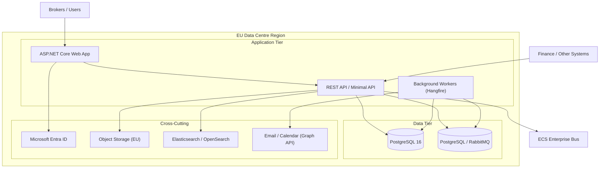
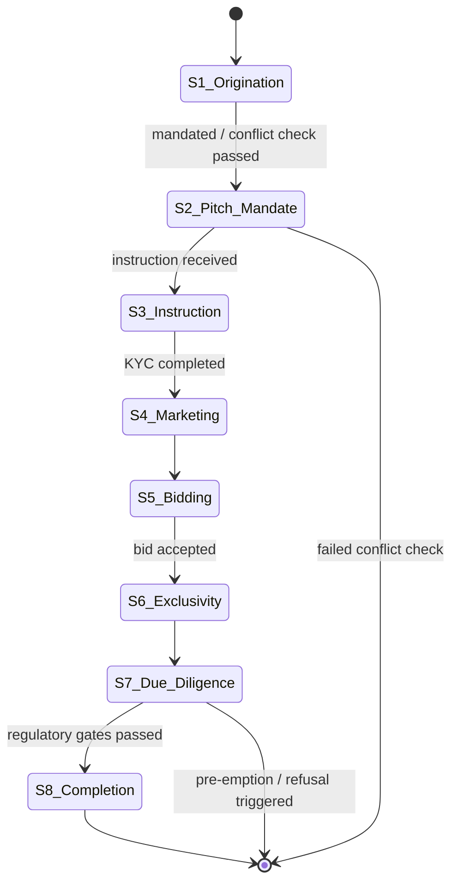

---
parent:"[[solution-overview]]"
status: Draft
author: Gary Newport
date: 08/09/2026
---

# Alternative Architecture — Traditional C# & PostgreSQL Stack

This note sets out an alternative to the [[power-apps-rationale|Power Apps / Dataverse]] design in [[solution-overview]]. It delivers the same business capabilities from [[business-capabilities]] but avoids Dynamics, Dataverse and the Power Platform, using the firm's existing engineering stack: C# (ASP.NET Core), PostgreSQL, and standard integration practices.

It is written as a design alternative for review by the same stakeholders and the TDA — it does not supersede the current design.

## Objectives

The alternative must satisfy the same success criteria as the current design:

- "Who is this client to Knight Frank across every service line, every country?"
- "What does our EU pipeline look like?"
- "How do we run CM deals?"

It must also:
- Keep all customer data in EU regions to satisfy GDPR, CNIL, and BDSG data-residency requirements
- Preserve the shared client/contact/property foundation and the layered service-line model
- Reuse existing in-house capability rather than licensing Microsoft platform per-user
- Remain operable by the existing C#/.NET and database engineering teams

## Why a Traditional Stack Fits

The current [[power-apps-rationale]] reasons that D365 Sales is a poor fit because Knight Frank's advisory lifecycle (pitch, NDA, multi-round bid, due diligence, regulatory gates) does not match the packaged Lead → Opportunity → Quote → Order → Invoice model, and eight of the core entities have no packaged equivalent. That argument favours a *custom* model — but a custom model does not require Dataverse. The same custom schema, workflows and security model can be built as first-party code on PostgreSQL, which is more direct than forcing the model onto a platform layer.

## High-Level Architecture

## Component Mapping

The table maps each Dataverse component from [[architecture-key-components]] to its traditional equivalent.

| Dataverse / Power Platform Component | Traditional Replacement | Notes |
| ------------------------------------ | ----------------------- | ----- |
| Dataverse (data store) | PostgreSQL 16 | Custom relational schema, JSONB for flexible per-country fields |
| Power Apps model-driven app (UI) | ASP.NET Core web application (Blazor or Razor Pages) | First-party UI, role-based views |
| Business Process Flows (BPFs) | .NET state-machine workflow engine | Explicit deal-lifecycle state model, single source of truth for transitions |
| Power Automate flows | Background workers (Hangfire) + message handlers | Email sync, document provisioning, finance bridge |
| Power Apps Security Roles + Business Units | ASP.NET Core RBAC + row-level security / tenant scoping | Country and service-line isolation via tenant id + policies |
| Dataverse audit trail | PostgreSQL audit triggers / temporal tables | 7-year retention, exportable |
| Power BI dashboards | Existing BI / reporting service feeding PostgreSQL | Connect directly to the database or materialised views |
| OData + custom API | REST API (ASP.NET Core) + OpenAPI | Same external integration surface |
| Power Apps Mobile | ASP.NET Core responsive web / PWA | No separate mobile runtime |
| Copilot for Sales (client matching) | First-party matching service (Postgres full-text + vector) | Existing data science stack |

## Application Architecture

### .NET Backend

- **ASP.NET Core** hosting a set of bounded-context APIs (`Client`, `Property`, `Deal`, `WIP`, `Compliance`).
- **EF Core (Npgsql)** for PostgreSQL access with migrations versioned in-repo.
- **Hangfire** (or an equivalent queue) for background work — email ingestion, sharepoint/document provisioning, finance bridge batches, address enrichment.
- **MassTransit / RabbitMQ** for asynchronous messaging and the ECS publish pattern.

### State Machine (Replacing BPFs)

The eight-stage Capital Markets deal lifecycle (S1 Origination → S8 Completion) from [[capital-markets-data-model]] becomes a first-class, typed state machine rather than a platform BPF.

Transition rules are code, so per-country gates (France city pre-emption / notarial deed, Spain right-of-refusal) are implemented as pluggable guards in the same framework the [[capital-markets-data-model|eight-stage lifecycle]] defines. Adding a country is a new set of guard rules, not a new platform layer.

### Security & Multi-Tenancy

- **Authentication:** Microsoft Entra ID (same requirements as the current design — MFA, conditional access, service principals).
- **Authorisation:** ASP.NET Core policy-based claims + a `tenancy` dimension on every aggregate root.
- **Row-level isolation:** PostgreSQL row-level security (RLS) keyed on country/team, mirroring the [[architecture-application|Business Unit hierarchy]] without a separate platform concept:
  - KF Global → KF_Europe → KF_France/Germany/Poland/Spain → KF_CM_France etc.

## Data Architecture — PostgreSQL

### Core Schema

The [[client-data-model|client]], [[property-data-model|property]], [[capital-markets-data-model|Capital Markets]] and [[wip-data-model|WIP]] models translate directly to relational tables. The `kf_*` entity names are preserved as table names.

- `accounts`, `contacts` — Client domain (one client, one view), including the Brand/Group → Legal Entity two-tier hierarchy from [[client-data-model]].
- `sites`, `properties`, `res_properties`, `deal_properties` — Property domain, preserving the "stable characteristics on the asset, deal-specific measures on the junction" rule from [[property-data-model]].
- `deals`, `pitches`, `ndas`, `bids`, `dd_milestones`, `red_flags`, `kyc_records`, `investor_profiles`, `data_room_accesses` — Capital Markets domain from [[capital-markets-data-model]].
- `fee_schedules`, `wip`, `transaction_reports` — Commercials and WIP from [[wip-data-model]].
- `address_formats` — cached international address format definitions used to render country-neutral addresses from [[property-data-model]].

### Country-Specific Fields

Where the Dataverse design uses dotted columns (`kf_fr_*`, `kf_de_*`, `kf_es_*`, `kf_pl_*`) added per layer, PostgreSQL offers two equivalent options:

| Option | Approach | Use |
| ------ | -------- | --- |
| Strongly typed columns | Additive nullable columns per country on shared tables; kept via migrations | Where the field is queried/reported on |
| `jsonb` extension payload | A `country_data jsonb` column holding country-specific fields | Where a field is country-only, rarely aggregated |

Both preserve the "no regional fork creates duplicate tables; adding a country = a new migration" rule as a code-level convention instead of a solution-layer rule.

### Audit & GDPR

- **Audit trail:** PostgreSQL triggers write append-only records to `audit_events` (who, what, when, before/after, source) with 7-year retention, mirroring the Dataverse audit requirement.
- **GDPR consent:** `processing_consent` column on contacts with the same legitimate-interest / consent / legal-obligation / not-assessed basis as in [[capital-markets-data-model]].
- **GDPR requests:** a `gdpr_requests` table records data-subject requests and tracks erasure/export actions.
- **Retention:** scheduled workers enforce retention and erasure per policy.

## Integration Architecture

The external integration surface from [[architecture-technology]] and [[architecture-application]] is reproduced with standard connectors rather than Power Automate.

| Integration | Dataverse approach | Traditional approach |
| ----------- | ------------------ | -------------------- |
| Change notification (Major entities) → ECS | Dataverse plugin / Power Automate publish | Outbox pattern → worker publishes to the ECS bus; logged to `integration_log` |
| Email sync / activity tracking | Power Automate + Outlook add-in | Microsoft Graph API (webhooks) + inbox worker ingesting to email/activity store |
| Document management | SharePoint auto-provisioned folders | Object storage (EU) with folder-per-deal convention; optional SharePoint sync |
| Address validation | Loqate lookup | Loqate/Postcoder lookup invoked by API; result cached in `address_formats` |
| Finance bridge (9 flows) | Power Automate flows to D365 Finance | Typed integration workers + a `finance_bridge` state table driving the same 9 flows (project create, % complete, invoice, payment, monthly WIP, credit hold, fee sync, close, reconcile) |
| Reporting / BI | Power BI to Dataverse | Existing BI tooling querying PostgreSQL / materialised views |

### Outbox Pattern for ECS

Rather than a platform plugin, each aggregate commit writes an outbox event in the same database transaction. A background dispatcher publishes to the ECS bus and, on success, marks the event sent (and logs to `integration_log`). This gives reliable, exactly-once change notification for Major entities without platform infrastructure.

## WIP to Finance Bridge

The 9-flow finance integration in [[wip-data-model]] maps to a `finance_bridge` state table with a worker per flow:

| Flow | Stage trigger | Worker behaviour |
| ---- | ------------- | ---------------- |
| 1 | S3 stage change | Create project in Finance |
| 2 | Any stage change | Push % complete |
| 3 | Deal won | Raise draft invoice request |
| 4 | Invoice posted | Sync invoice/payment back |
| 5 | Monthly batch | Refresh WIP balance and ageing |
| 6 | Credit hold | Notify broker (Teams/webhook) |
| 7 | Fee schedule change | Sync budget/contract lines |
| 8 | Deal closure | Final revenue recognition |
| 9 | Monthly | Reconciliation report |

## Deployment & Hosting

| Component | Hosting | Region |
| --------- | ------- | ------ |
| ASP.NET Core app + API | Containerised (App Service / AKS) | EU |
| PostgreSQL 16 | Managed EU region (PaaS) | EU |
| Object storage / attachments | Managed EU blob/object storage | EU |
| Messaging queue | Managed message broker | EU |
| Entra ID | Microsoft Cloud | — |

**Data residency:** all service data stays in EU regions, matching the requirement in [[architecture-technology]] that all customer data reside in EU data centres.

**Environment strategy** follows the same DEV → TEST → UAT → PROD path, with migrations versioned and promoted rather than managed-solution layers. The "no unmanaged customisations in TEST/UAT/PROD" rule becomes "production migrations are reviewed and gated."

## Security Model

| Aspect | Approach |
| ------ | -------- |
| Authentication | Microsoft Entra ID, MFA enforced, conditional access |
| Authorisation | ASP.NET Core policies + PostgreSQL RLS for tenant isolation |
| Field-level security | Column-level protections on sensitive fields (GDPR consent, fee data) |
| Encryption at rest | Managed-disk / database encryption (AES-256), customer-managed keys optional |
| Encryption in transit | TLS 1.2+ |
| Audit & retention | PostgreSQL audit triggers, 7-year retention |

## Diagnostic, Compliance & Observability

- **Observability:** standard logging/tracing/metrics (e.g. OpenTelemetry) plus an `integration_log` for CRM-specific integration tracking, mirroring [[architecture-technology]].
- **Compliance:** GDPR consent + data-subject request handling, EU data residency, 7-year audit. CNIL and BDSG requirements apply identically.
- **TDA oversight:** applied via standard code review, migration review, and production gating.

## Cost & Operability Implications

| Aspect | Dataverse / Power Platform | Traditional C#/PostgreSQL |
| ------ | -------------------------- | ------------------------- |
| Platform licensing | Per-user / per-app / per-org (Dataverse, Power Apps, Power Automate, Power BI, D365) | No platform per-user license; infrastructure cost only |
| Engineering resourcing | Low-code config; Power Platform specialists | Full-stack C#/database engineering; reuses existing skill set |
| Skill availability | Microsoft Power Platform skills | Existing in-house .NET & PostgreSQL capability |
| Velocity for iteration | Rapid low-code changes | Requires build/test/deploy cycle |
| Long-term lock-in | Microsoft platform | First-party code, portable database |

## Trade-offs vs. the Dataverse Design

To be weighed at TDA review:

- **For the traditional stack:** no per-user platform licensing; reuses the existing engineering stack; first-party code is fully portable and debuggable; RLS gives precise tenancy isolation; no dependence on Dataverse capacity and governance limits.
- **Against the traditional stack:** lower-code UI and simple workflows are faster to stand up on Power Apps; Dataverse ships native Outlook/SharePoint/Teams integration and an audit trail out of the box that must be rebuilt; fixed infrastructure must be provisioned, secured, and operated rather than leased; selling the build to leadership differs from buying seats.
- The eight-entity fit gap in [[power-apps-rationale]] that argued for a *custom* model applies equally to both options — the difference is whether the custom model is built on Dataverse or on first-party code.

## Open Questions for TDA

- Is the existing enterprise integration / messaging bus a suitable target, i.e. can the same ECS publish pattern be consumed by a background worker as by a platform plugin?
- Does Finance integration require D365 Finance as the downstream system, or are the 9 flows portable to the current finance systems?
- Confirmed Major-entity list for ECS change notification (Client, Property, Deal domains — definitive list still pending).
- Final low-code vs. code decision, balancing platform licensing cost against build and operating effort.

## Related Documents

- [[solution-overview]] — Parent document; current (Dataverse) design
- [[power-apps-rationale]] — The platform decision this note challenges
- [[business-capabilities]] — Capability model both designs must satisfy
- [[client-data-model]] — Client schema reused here
- [[property-data-model]] — Property schema reused here
- [[capital-markets-data-model]] — Capital Markets lifecycle reused here
- [[wip-data-model]] — WIP / finance bridge reused here
- [[architecture-application]] — Current application & integration patterns
- [[architecture-technology]] — Current hosting & security model