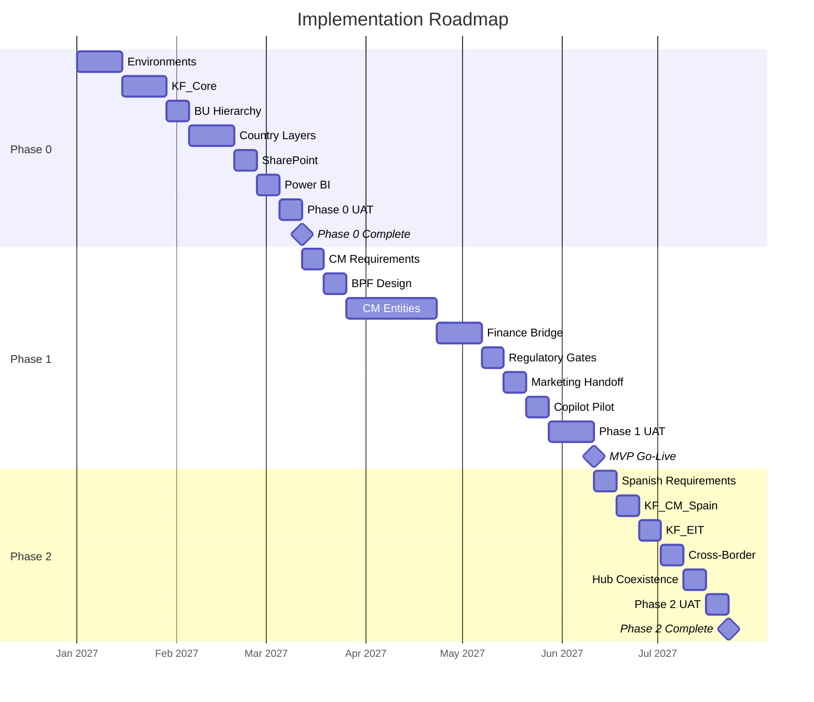

---
parent:"[[solution-overview]]"
---

# Implementation Roadmap — Timelines

## Timeline Overview

8 phases spanning 6-12 months for MVP (Phases 0-1), with future phases dependent on business priorities.

## Detailed Timeline

### Phase 0: Foundation ("CRM Lite")

| Week | Milestone | Deliverable | Owner |
| ---- | --------- | ----------- | ----- |
| 1 | Kick-off | Project plan finalised | Project Lead |
| 2 | Environments Ready | DEV, TEST, UAT, PROD provisioned | IT |
| 3 | KF_Core Deployed | 40+ table shells, option sets | Solution Architect |
| 4 | BU Hierarchy Configured | Security roles, BU isolation | Security Lead |
| 5 | KF_Europe Deployed | EUR defaults, GDPR baseline | Solution Architect |
| 6 | Country Layers Deployed | FR, DE, PL, ES solutions | Solution Architect |
| 7 | SharePoint Integration | Deal folder auto-provision | Integration Lead |
| 8 | Power BI Foundation | Regional dashboard | BI Lead |
| 9 | UAT Complete | Phase 0 testing signed off | QA Lead |
| 10 | Phase 0 Sign-off | Ready for Phase 1 | Project Lead |

**Critical Path:** Environments → KF_Core → BU Hierarchy → Country Layers → SharePoint → Sign-off

### Phase 1: Paris CM Deep Build

| Week | Milestone | Deliverable | Owner |
| ---- | --------- | ----------- | ----- |
| 11 | Kick-off | CM requirements finalised | Business Analyst |
| 12 | BPF Designed | 8-stage BPF configured | Solution Architect |
| 13 | CM Entities Deployed | Deal, Pitch, NDA, Bid | Solution Architect |
| 14 | CM Entities Deployed | DDMilestone, RedFlag, KYC | Solution Architect |
| 15 | CM Entities Deployed | InvestorProfile, DataRoom | Solution Architect |
| 16 | CM Entities Deployed | FeeSchedule, TransactionReport | Solution Architect |
| 17 | Finance Bridge Designed | 9 integration flows mapped | Integration Lead |
| 18 | Finance Bridge Implemented | D365 Finance integration | Integration Lead |
| 19 | French Regulatory Gates | City pre-emption, notarial deed | Compliance Lead |
| 20 | Marketing Handoff | CI-Journeys integration | Marketing Lead |
| 21 | Copilot Pilot | Copilot for Sales configured | AI Lead |
| 22 | UAT Complete | Paris CM team testing | QA Lead |
| 23 | UAT Fixes Applied | Issues resolved | Development Team |
| 24 | Pre-Go-Live | Final validation | Project Lead |
| 25 | Go-Live Prep | Training materials, rollout plan | Change Lead |
| 26 | MVP Go-Live | Phase 1 live | Project Lead |

**Critical Path:** BPF → CM Entities → Finance Bridge → Regulatory Gates → UAT → Go-Live

### Phase 2: Madrid + EIT CM Deep Build

| Week | Milestone | Deliverable | Owner |
| ---- | --------- | ----------- | ----- |
| 27 | Kick-off | Spanish requirements finalised | Business Analyst |
| 28 | KF_CM_Spain Deployed | Spanish regulatory gate | Solution Architect |
| 29 | KF_EIT Deployed | Cross-border overlay | Solution Architect |
| 30 | Cross-Border Portfolios | Multi-jurisdiction view | Solution Architect |
| 31 | Multi-Jurisdiction KYC | Cross-border compliance | Compliance Lead |
| 32 | Hub Coexistence | Manual transition strategy | Integration Lead |
| 33 | UAT Complete | Madrid team testing | QA Lead |
| 34 | Phase 2 Sign-off | Ready for Phase 3 | Project Lead |

## Visual Timeline (Mermaid)

## Key Milestones

| Milestone | Target Week | Phase | Dependencies |
| --------- | ----------- | ----- | ------------ |
| Environments Ready | Week 2 | Phase 0 | IT provisioning |
| KF_Core Deployed | Week 4 | Phase 0 | Environment ready |
| BU Hierarchy Configured | Week 6 | Phase 0 | KF_Core deployed |
| Country Layers Deployed | Week 8 | Phase 0 | BU hierarchy configured |
| Phase 0 Complete | Week 10 | Phase 0 | All Phase 0 tasks complete |
| BPF Configured | Week 12 | Phase 1 | Phase 0 complete |
| CM Entities Deployed | Week 16 | Phase 1 | BPF configured |
| Finance Bridge Tested | Week 20 | Phase 1 | CM entities deployed |
| UAT Complete | Week 24 | Phase 1 | Finance bridge tested |
| MVP Go-Live | Week 26 | Phase 1 | UAT complete |

## Resource Requirements

### Phase 0 (8-10 weeks)

| Role | FTE | Duration |
| ---- | --- | -------- |
| Project Lead | 0.5 | 10 weeks |
| Solution Architect | 1.0 | 8 weeks |
| Security Lead | 0.5 | 4 weeks |
| Integration Lead | 0.5 | 2 weeks |
| BI Lead | 0.5 | 2 weeks |
| QA Lead | 0.5 | 2 weeks |
| **Total** | **3.5** | |

### Phase 1 (12-16 weeks)

| Role | FTE | Duration |
| ---- | --- | -------- |
| Project Lead | 0.5 | 16 weeks |
| Solution Architect | 1.0 | 14 weeks |
| Business Analyst | 0.5 | 4 weeks |
| Integration Lead | 1.0 | 6 weeks |
| Compliance Lead | 0.5 | 2 weeks |
| Marketing Lead | 0.5 | 2 weeks |
| AI Lead | 0.5 | 2 weeks |
| QA Lead | 0.5 | 4 weeks |
| Change Lead | 0.5 | 2 weeks |
| **Total** | **5.5** | |

## Timeline Risks

| Risk | Likelihood | Impact | Mitigation |
| ---- | ---------- | ------ | ---------- |
| Phase 0 overruns | Medium | High | Early environment provisioning, parallel workstreams |
| Phase 1 overruns | High | High | Phased CM entity deployment, early UAT |
| Resource availability | Medium | Medium | Cross-training, shared resources |
| Licensing delays | Medium | Medium | Early procurement, Microsoft engagement |
| Regulatory changes | Low | High | Regular legal review, flexible design |

## Related Documents

- [[implementation-phases]] — Phase definitions and scope
- [[roadmap-dependencies]] — Dependency register
- [[solution-package-model]] — Layer architecture
