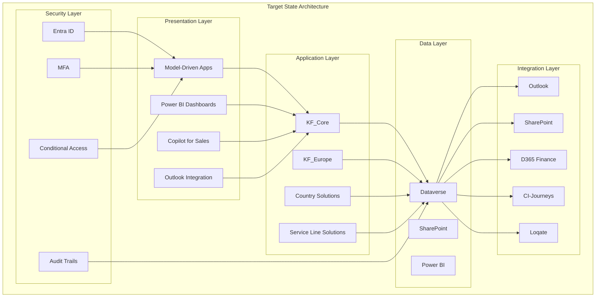

# Architecture — Target State

Status: Draft
Parent: [[solution-overview]]

## Target State Architecture

### Vision

A unified, cloud-native CRM platform serving all Knight Frank European service lines and countries, built on Microsoft Power Platform with Dataverse as the single source of truth for client, property, and deal data.

### Target State Components

## Standards, PADs, and Blueprints

| Standard/Blueprint | Status | Relevance | Compliance |
| ------------------ | ------ | --------- | ---------- |
| CTO Architecture Principles | Referenced | High | ✅ Compliant |
| Enterprise data residency standards | TBD | High | ✅ Compliant (EU-hosted) |
| Security baseline | TBD | High | ✅ Compliant (Entra ID, MFA, encryption) |
| Integration patterns | TBD | Medium | ✅ Compliant (API-first, standard connectors) |
| Power Platform Centre of Excellence | Referenced | Medium | ✅ Aligned |

## Target State Capabilities

### Client Management (Phase 0)

- Single source of truth for all client data
- Two-tier hierarchy: Brand/Group → Legal Entity
- SIC-coded industry classification (66 KF sectors)
- Multi-country, multi-service line view

### Property Management (Phase 0)

- Canonical physical sites with addresses and coordinates
- Commercial and residential properties
- Energy ratings and EPC data
- 10 service lines read same property record

### Deal Management (Phase 1)

- 8-stage BPF from lead generation to completion
- 12 CM entities for full deal lifecycle
- Regulatory gates per market
- Cross-border portfolio management

### Financial Management (Phase 1)

- WIP tracking with % complete tied to BPF stage
- Fee management with billing triggers
- 9 integration flows to D365 Finance
- Transaction report automation

### Compliance & Governance (Phase 0)

- KYC/AML checks at legal entity level
- GDPR consent tracking with audit trail
- 7-year retention with exportable audit logs
- Red flag tracking and conflict checks

### Integration & Analytics (Phase 1)

- Outlook email tracking and activity logging
- SharePoint deal folder auto-provisioning
- CI-Journeys marketing handoff
- Power BI dashboards and reports

## Target State vs Current State

| Capability | Current State | Target State | Gap |
| ---------- | ------------- |--------------| ----- |
| Client data | Manual spreadsheets | Centralised Dataverse | High |
| Property data | Fragmented systems | Single source of truth | High |
| Deal tracking | Email-based | Automated BPF | High |
| Financial tracking | Manual WIP | Integrated bridge | Medium |
| Compliance | Ad-hoc processes | Automated gates | High |
| Reporting | Siloed data | Unified Power BI | High |

## Implementation Roadmap

| Phase | Scope | Duration | Status |
| ----- | ----- | -------- | ------ |
| Phase 0 | Foundation (L2-L4) | 8-10 weeks | Planning |
| Phase 1 | Paris CM Deep Build (L5-L6) | 12-16 weeks | Planning |
| Phase 2 | Madrid + EIT (L6-L7) | 10-14 weeks | Not started |
| Phase 3 | Additional Service Lines | Future | Not started |
| Phase 4 | Residential / Private Office | Future | Not started |
| Phase 5 | Regional Expansion | Future | Not started |
| Phase 6 | Hub Replacement | Future | Not started |
| Phase 7 | Consolidated Finance ERP | Future | Not started |

## Success Criteria

### Technical Success

- [ ] All components deployed and functional
- [ ] Security model implemented and tested
- [ ] Integrations working end-to-end
- [ ] Performance meets requirements
- [ ] Compliance requirements met

### Business Success

- [ ] User adoption targets met
- [ ] Process efficiency improvements achieved
- [ ] Data quality targets met
- [ ] Financial targets achieved
- [ ] Compliance requirements satisfied

## Related Documents

- [[architecture-principles-compliance]] — Principles compliance mapping
- [[architecture-overview-diagrams]] — Architecture diagrams
- [[solution-package-model]] — Layer architecture
- [[implementation-phases]] — Phase definitions
