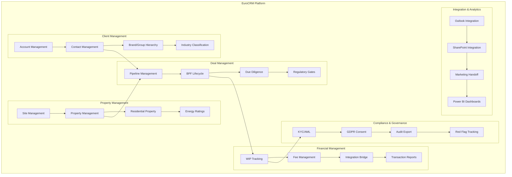

# Business Capabilities

Status: Draft
Parent: [[solution-overview]]

## Capability Map

## Core CRM Capabilities

### Client Management

- **Account Management:** Legal entity records with SIC-coded industry classification (66 KF sectors)
- **Contact Management:** Individual contacts linked to accounts with roles and preferences
- **Brand/Group Hierarchy:** Two-tier model: Brand/Group → Legal Entity
- **Industry Classification:** SIC codes mapped to KF sectors with gap analysis

### Property Management

- **Site Management:** Canonical physical sites with addresses and coordinates
- **Property Management:** Commercial and residential properties linked to sites
- **Residential Property:** Sales, lettings, and property management
- **Energy Ratings:** EPC and energy performance data

### Deal Management

- **Pipeline Management:** 8-stage BPF from lead generation to completion
- **BPF Lifecycle:** Stage-specific activities, documents, and regulatory gates
- **Due Diligence:** NDA, KYC, data room access, red flag tracking
- **Regulatory Gates:** City pre-emption (France), right-of-refusal (Spain), notarial deed

### Financial Management

- **WIP Tracking:** Work-in-progress with % complete tied to BPF stage
- **Fee Management:** Fee schedules with agreed fees and billing triggers
- **Integration Bridge:** 9 flows to D365 Finance (project creation, WIP sync, transaction reports)
- **Transaction Reports:** Auto-generated reports for deal completion

### Compliance & Governance

- **KYC/AML:** Know Your Customer checks at legal entity level
- **GDPR Consent:** Data processing consent tracking with audit trail
- **Audit Export:** 7-year retention with exportable audit logs
- **Red Flag Tracking:** Conflict checks and risk identification

### Integration & Analytics

- **Outlook Integration:** Email tracking and activity logging
- **SharePoint Integration:** Deal folder auto-provisioning and document management
- **Marketing Handoff:** CI-Journeys integration for campaign automation
- **Power BI Dashboards:** Regional reporting and analytics

## Regional Capabilities

### Multi-Country Support

- **France:** City pre-emption gate, notarial deed requirement
- **Spain:** Right-of-refusal gate, Community of Madrid preference
- **Germany:** Vacancy fee gate, Baugenehmigung requirement
- **Poland:** Municipal pre-emption gate, agricultural land restrictions

### Multi-Service Line Support

- **Capital Markets:** Property sales and acquisitions
- **Occupier Strategy & Solutions:** Tenant representation and workplace consulting
- **Valuations:** Property valuations and advisory
- **Residential:** Sales, lettings, and property management
- **Private Office:** Ultra-high-net-worth individual services

### Cross-Border Operations

- **Multi-Jurisdiction KYC:** Compliance checks across borders
- **Intercompany Billing:** Fee allocation across regions
- **Portfolio Management:** Cross-border property portfolios

## Capability Maturity

| Capability | Current State | Target State | Gap |
| ---------- | ------------- |--------------| ----- |
| Client Management | Manual spreadsheets | Centralised Dataverse | High |
| Property Management | Fragmented systems | Single source of truth | High |
| Deal Management | Email-based tracking | Automated BPF | High |
| Financial Management | Manual WIP tracking | Integrated bridge | Medium |
| Compliance & Governance | Ad-hoc processes | Automated gates | High |
| Integration & Analytics | Siloed data | Unified platform | High |
